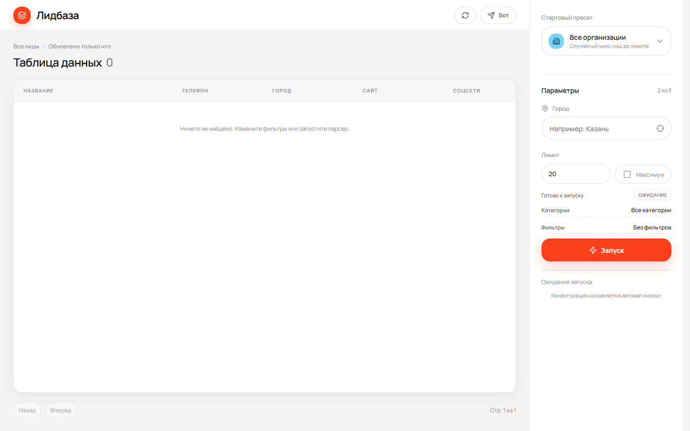
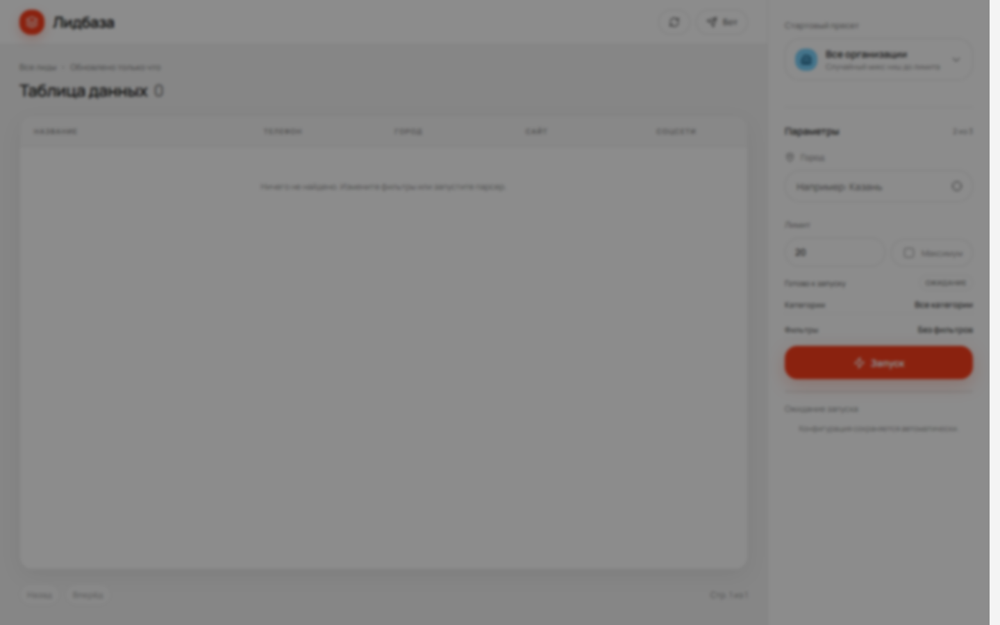
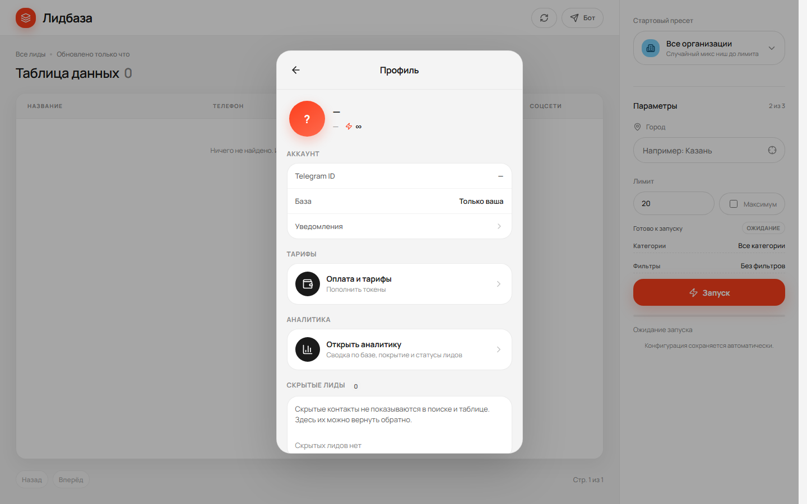
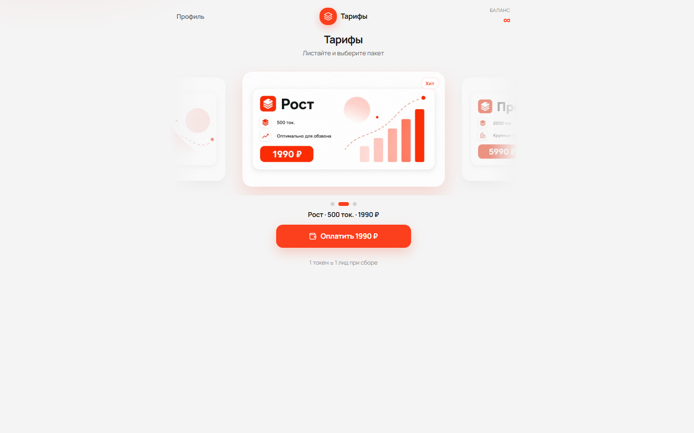
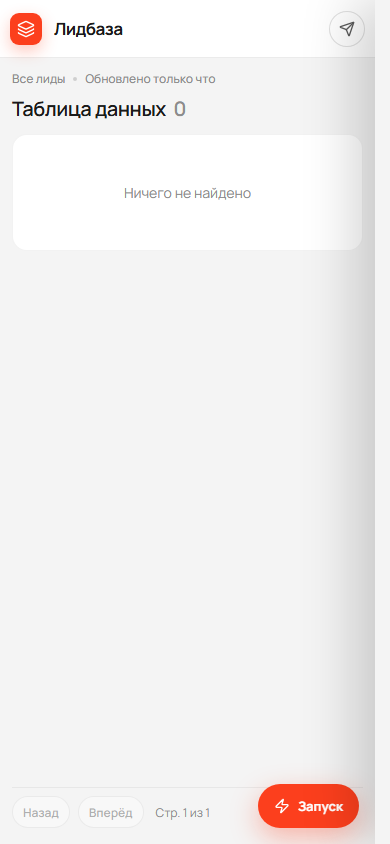

# Разработка сайтов, приложений и модулей

Разрабатываем сайты, мобильные и веб-приложения, модули, делаем интеграции, внедрения и настройку CRM.

Заказы и связь:
- Telegram: https://t.me/SlavicBrother
- Авито: https://www.avito.ru/belorechensk/rezume/programmist_3450868081

---

# Лидбаза

Готовый продукт для сбора и работы с контактами организаций: своя база лидов, обзвон, Telegram и удобная панель в браузере и на телефоне.

Подходит отделам продаж, маркетологам, агентствам и предпринимателям, которым нужна свежая база по городу и нише — без ручного копирования карточек с карт.

## Суть продукта

Выбираете город и нишу → запускаете сбор → получаете таблицу с названиями, телефонами, сайтами и соцсетями. Дальше работаете со своей базой: фильтруете, отмечаете статусы обзвона, смотрите аналитику и пополняете токены под объём задач.

## Возможности

| Раздел | Что умеет |
|--------|-----------|
| Сбор контактов | Поиск организаций по городу и категории, лимит объёма, запуск в один клик |
| База лидов | Название, телефон, город, сайт, соцсети — только ваша база |
| Обзвон | Статусы работы с лидами, скрытие ненужных карточек |
| Фильтры | Город, телефон, рейтинг, статусы — быстрый отбор для работы |
| Аналитика | Сводка по базе: покрытие телефонами, сайтами, соцсетями |
| Профиль | Уведомления, документы, вход в аналитику и тарифы |
| Telegram | Бот и мини-приложение: удобный вход и доступ с телефона |
| Тарифы | Пакеты токенов под разные объёмы сбора |

## Интерфейс

### Панель и запуск сбора

### Параметры сбора

### Профиль

### Тарифы и оплата

### Мобильная версия

## Для кого

- компании и ИП, которым нужна база для обзвона по городу;
- отделы продаж и колл-центры;
- агентства, собирающие лиды под клиентов;
- те, кто хочет вести свою базу контактов в одном месте — с телефона и с компьютера.

## Результат для бизнеса

Меньше ручной работы по сбору контактов, быстрее выход на обзвон, своя база под рукой и понятные тарифы под нужный объём.

---

Нужен похожий сервис, доработка или внедрение под ваши задачи — напишите в Telegram или оставьте заявку на Авито.
